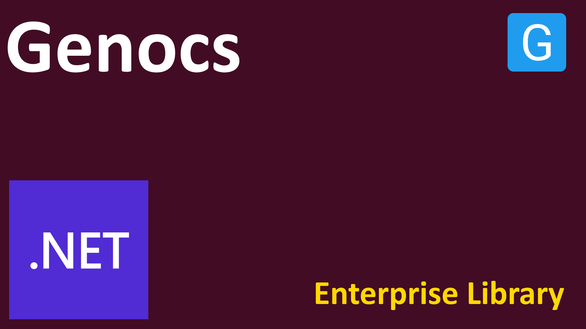

<!-- PROJECT SHIELDS -->
[![License][license-shield]][license-url]
[![Build][build-shield]][build-url]
[![Downloads][downloads-shield]][downloads-url]
[![Contributors][contributors-shield]][contributors-url]
[![Forks][forks-shield]][forks-url]
[![Stargazers][stars-shield]][stars-url]
[![Issues][issues-shield]][issues-url]
[![Discord][discord-shield]][discord-url]
[![Gitter][gitter-shield]][gitter-url]
[![Twitter][twitter-shield]][twitter-url]
[![Twitterx][twitterx-shield]][twitterx-url]
[![LinkedIn][linkedin-shield]][linkedin-url]

[license-shield]: https://img.shields.io/github/license/Genocs/genocs-library?color=2da44e&style=flat-square
[license-url]: https://github.com/Genocs/genocs-library/blob/main/LICENSE
[build-shield]: https://github.com/Genocs/genocs-library/actions/workflows/build_and_test.yml/badge.svg?branch=main
[build-url]: https://github.com/Genocs/genocs-library/actions/workflows/build_and_test.yml
[downloads-shield]: https://img.shields.io/nuget/dt/Genocs.Microservice.Template.svg?color=2da44e&label=downloads&logo=nuget
[downloads-url]: https://www.nuget.org/packages/Genocs.Microservice.Template
[contributors-shield]: https://img.shields.io/github/contributors/Genocs/genocs-library.svg?style=flat-square
[contributors-url]: https://github.com/Genocs/genocs-library/graphs/contributors
[forks-shield]: https://img.shields.io/github/forks/Genocs/genocs-library?style=flat-square
[forks-url]: https://github.com/Genocs/genocs-library/network/members
[stars-shield]: https://img.shields.io/github/stars/Genocs/genocs-library.svg?style=flat-square
[stars-url]: https://img.shields.io/github/stars/Genocs/genocs-library?style=flat-square
[issues-shield]: https://img.shields.io/github/issues/Genocs/genocs-library?style=flat-square
[issues-url]: https://github.com/Genocs/genocs-library/issues
[discord-shield]: https://img.shields.io/discord/1106846706512953385?color=%237289da&label=Discord&logo=discord&logoColor=%237289da&style=flat-square
[discord-url]: https://discord.com/invite/fWwArnkV
[gitter-shield]: https://img.shields.io/badge/chat-on%20gitter-blue.svg
[gitter-url]: https://gitter.im/genocs/
[twitter-shield]: https://img.shields.io/twitter/follow/genocs?color=1DA1F2&label=Twitter&logo=Twitter&style=flat-square
[twitter-url]: https://twitter.com/genocs
[linkedin-shield]: https://img.shields.io/badge/-LinkedIn-black.svg?style=flat-square&logo=linkedin&colorB=555
[linkedin-url]: https://www.linkedin.com/in/giovanni-emanuele-nocco-b31a5169/
[twitterx-shield]: https://img.shields.io/twitter/url/https/twitter.com/genocs.svg?style=social
[twitterx-url]: https://twitter.com/genocs


<p align="center">
    
</p>


 QRCode scanner and builder
=========

This library can be used to build and scan images containing QR code.

The library allows to build a different type of Barcode.

The library do not contains reference to System.Drawing.Common library, so it can be used into Docker Image Linux native


[](https://github.com/Genocs/qrcode/actions/workflows/dotnet.yml) [](https://app.travis-ci.com/github/Genocs/qrcode) <a href="https://www.nuget.org/packages/Genocs.QRCodeLibrary/" rel="Genocs.QRCodeLibrary"></a> <a href="https://hub.docker.com/repository/docker/genocs/qrcode/" rel="Genocs.QRCodeLibrary"></a> [](https://gitter.im/genocs/)


## References

Please see the original version at [codeproject](https://www.codeproject.com/Articles/1250071/QR-Code-Encoder-and-Decoder-NET-Framework-Standard/).

## Commands

###  Build the project

To build and test the project type following command:

```ps
dotnet build
dotnet test
```

Steps to build the Docker image and run the container

```ps
# Build the Docker image
docker build -t genocs.qrcode.api .

# Add a tag
docker tag genocs.qrcode.api genocs/qrcode.api

# Push to the container registry
docker push genocs/qrcode.api

# Run the container 
docker run -p 90:80 -d --name qrcodeapi-container genocs/qrcode.api
```

If you want to use the container into a docker network:

``` ps
docker run -p 90:80 -d --name qrcodeapi-container genocs/qrcode.api --network genocs-network
```

###  Push the images to the Docker image repository (Docker Hub)

The tagname is optional

``` ps
docker push genocs/qrcode.api:tagname
```

### Pull the image from Docker image repository (Docker Hub)

``` ps
docker pull genocs/qrcode.api:tagname
```


### Deploy in a cloud instance

You can deploy Demo Application with one click in Heroku, Microsoft Azure, or Google Cloud Platform: 

[](https://heroku.com/deploy?template=https://github.com/heartexlabs/label-studio/tree/heroku-persistent-pg)
[](https://portal.azure.com/#create/Microsoft.Template/uri/https%3A%2F%2Fraw.githubusercontent.com%2Fheartexlabs%2Flabel-studio%2Fmaster%2Fazuredeploy.json)
[](https://deploy.cloud.run)

## License

This project is licensed with the [MIT license](LICENSE).

## Changelogs

View Complete [Changelogs](https://github.com/Genocs/microservice-template/blob/main/CHANGELOGS.md).

## Community

- Discord [@genocs](https://discord.com/invite/fWwArnkV)
- Facebook Page [@genocs](https://facebook.com/Genocs)
- Youtube Channel [@genocs](https://youtube.com/c/genocs)


## Support

Has this Project helped you learn something New? or Helped you at work?
Here are a few ways by which you can support.

- ⭐ Leave a star! 
- 🥇 Recommend this project to your colleagues.
- 🦸 Do consider endorsing me on LinkedIn for ASP.NET Core - [Connect via LinkedIn](https://www.linkedin.com/in/giovanni-emanuele-nocco-b31a5169/) 
- ☕ If you want to support this project in the long run, [consider buying me a coffee](https://www.buymeacoffee.com/genocs)!
  

[](https://www.buymeacoffee.com/genocs)

## Code Contributors

This project exists thanks to all the people who contribute. [Submit your PR and join the team!](CONTRIBUTING.md)

[](https://github.com/genocs/blazor-template/graphs/contributors)

## Financial Contributors

Become a financial contributor and help me sustain the project. [Support the Project!](https://opencollective.com/genocs/contribute)

<a href="https://opencollective.com/genocs"></a>


## Acknowledgements
- [devmentors](https://github.com/devmentors)
- [abp](https://github.com/abpframework)